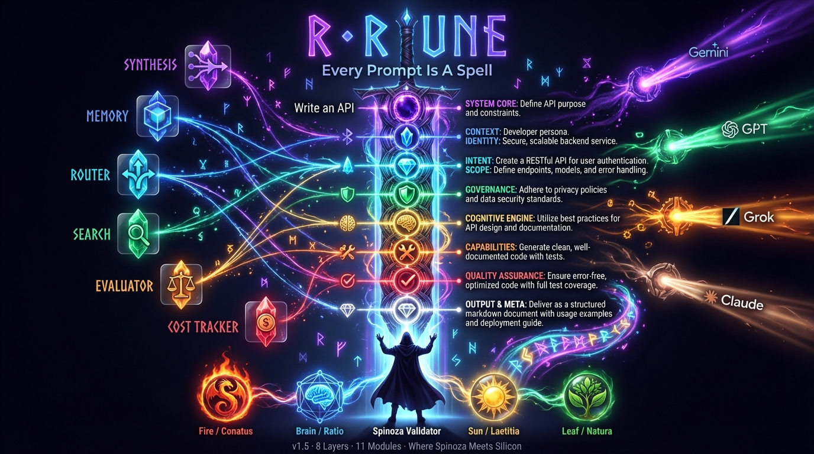
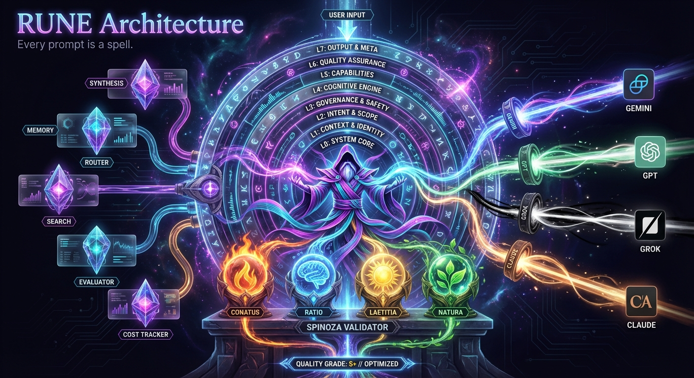
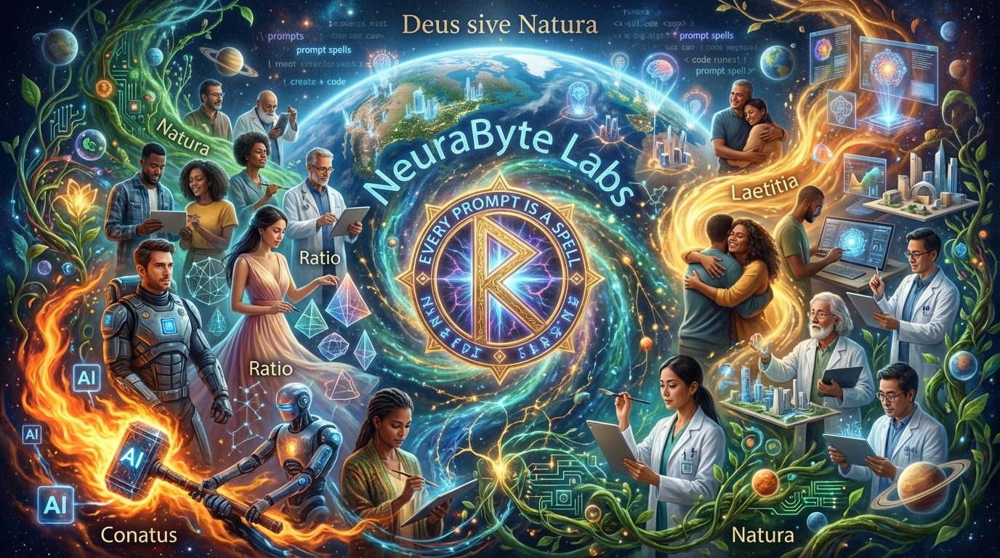

<div align="center">



<br><br>

# ᚱ RUNE

### The Prompt Engineering Framework That Thinks

*Where Spinoza Meets Silicon*

<br>

[](https://python.org)
[](LICENSE)
[](#-whats-new-in-v20)
[](#-supported-models)
[](#-grimoire-prompt-library)

<br>

[**Quick Start**](#-quick-start) · [**SWARM**](#-rune-swarm) · [**Architecture**](#-architecture) · [**Grimoire**](#-grimoire-prompt-library) · [**Benchmarks**](#-benchmarks) · [**Roadmap**](#-roadmap)

<br>

---

**RUNE** wraps your prompts in an **8-layer semantic engine**, validates outputs through<br>
**Spinoza's philosophy**, and now evolves them through **multi-agent competition**.

One prompt in. The best prompt survives.

---

</div>

<br>

## The Problem

Most prompts are flat text — unstructured, ambiguous, model-dependent. You write a prompt, cross your fingers, and hope. If the output is bad, you rewrite manually. Repeat.

**RUNE eliminates the guesswork.**

<div align="center">

| | Traditional Prompting | RUNE | RUNE SWARM |
|---|---|---|---|
| **Perspectives** | 1 | 1 (enhanced) | **3-6 parallel agents** |
| **Structure** | None | 8-layer pipeline | 8-layer × N agents |
| **Validation** | Hope | Spinoza Validator (A-F) | Spinoza Tournament |
| **Evolution** | Manual rewrite | Auto-enhance | **Darwinian competition** |
| **Blind spots** | Many | Fewer | **Devil's Advocate catches them** |
| **Quality** | ~45/100 | ~65/100 | **~80/100** |

</div>

<br>

## ⚡ Quick Start

```bash
git clone https://github.com/neurabytelabs/rune.git
cd rune
pip install requests   # only dependency

# Configure (xAI recommended — fast, cheap, 2M context)
mkdir -p ~/.rune
cat > ~/.rune/config.toml << 'EOF'
[llm]
api_url = "https://api.x.ai/v1/chat/completions"
default_model = "grok-4-1-fast-reasoning"
EOF

# Set your API key
echo 'export XAI_API_KEY="your-key"' >> ~/.secrets && source ~/.secrets
```

### Three ways to use RUNE:

```bash
# 1. WAND — Single prompt enhancement
python3 wand.py cast "Build a REST API for a fintech app"

# 2. SWARM — Multi-agent evolution (NEW in v2.0)
python3 swarm.py "Design the future of AI interfaces" --agents 5 --rounds 2

# 3. RUNE.md — Paste into any AI chat (zero setup)
# Upload RUNE.md to ChatGPT/Claude/Gemini → confirm "RUNE Active" → done
```

<br>

<div align="center">

## 🐝 RUNE SWARM

**Multi-Agent Prompt Evolution Engine** — *New in v2.0*

</div>

SWARM spawns multiple AI agents, each with a radically different thinking strategy. They compete, evolve, and fuse into a response **better than any single agent could produce**.

```
YOUR PROMPT
    │
    ▼
┌─────────────────────────────────────────────────────┐
│              🐝 RUNE SWARM ORCHESTRATOR              │
│                                                      │
│   🎓 Expert    🎨 Creative    😈 Devil's Advocate    │
│   🔬 Synthesizer   ✂️ Minimalist    🃏 Wild Card     │
│                                                      │
│   Each agent generates → executes → gets scored      │
│                                                      │
│   ┌──────────────────────────────────────────────┐   │
│   │         ⚔️ SPINOZA TOURNAMENT                 │   │
│   │   Score all → Rank → Cross-pollinate →       │   │
│   │   Evolve (Round 2) → Select Top K            │   │
│   └──────────────────────────────────────────────┘   │
│                      │                               │
│                      ▼                               │
│            🔮 SYNTHESIS FUSION                       │
│         Merge top agents → Final output              │
└─────────────────────────────────────────────────────┘
    │
    ▼
DEFINITIVE RESPONSE (forged from N minds)
```

### The Swarm Agents

| Agent | Strategy | What It Does |
|-------|----------|-------------|
| 🎓 **Expert** | Domain authority | The professor who wrote the textbook. Precise, structured, data-driven. |
| 🎨 **Creative** | Lateral thinking | Unexpected metaphors, novel connections, the angle nobody considered. |
| 😈 **Devil's Advocate** | Contrarian | Destroys weak ideas first, then builds battle-tested solutions. |
| 🔬 **Synthesizer** | Cross-domain | Connects science, philosophy, art, and business into unified frameworks. |
| ✂️ **Minimalist** | Occam's razor | Maximum clarity, minimum words. Every sentence earns its place. |
| 🃏 **Wild Card** | Random mutation | Breaks conventions. The unexpected insight that changes everything. |

### Real Results

```bash
$ python3 swarm.py "Design a revolutionary AI product" --agents 5 --rounds 2

🐝 RUNE SWARM v0.1
Agents: 5  |  Model: grok-4-1  |  Rounds: 2

── Round 1 ──
  🎓 Expert         75.0/100 🏆
  😈 Devil's Adv    68.4/100
  🔬 Synthesizer    65.2/100
  🎨 Creative       64.6/100
  ✂️ Minimalist     65.8/100

── Round 2 (Cross-Pollination) ──
  🎓 Expert         79.6/100 🏆  (+6.1%)
  😈 Devil's Adv    72.8/100     (+6.4%)
  🔬 Synthesizer    69.0/100     (+5.8%)

🔮 SYNTHESIS        77.6/100
   5 agents → 2 rounds → 1 definitive answer
```

**Cross-pollination works.** Agents see top performers' outputs in Round 2 and evolve. Scores improve 5-6% per round.

```bash
# SWARM CLI
python3 swarm.py "your prompt"                    # 3 agents, 1 round
python3 swarm.py "your prompt" --agents 5         # 5 agents
python3 swarm.py "your prompt" --rounds 2         # 2 evolution rounds
python3 swarm.py "your prompt" --all --rounds 3   # Full swarm, 3 rounds
python3 swarm.py "your prompt" -v                 # Verbose (show responses)
```

<br>

<div align="center">

## 🏗 Architecture



</div>

### The 8-Layer Enhancement Engine

Every prompt passes through 8 semantic layers before reaching the LLM:

```
┌─────────────────────────────────────────────────────────────┐
│                      RUNE v2.0                              │
│                                                             │
│  ┌─── ENHANCEMENT ──────────────────────────────────────┐   │
│  │  L0  System Core ─── Role, mode, temporal anchor     │   │
│  │  L1  Context ──────── Domain, expertise, history     │   │
│  │  L2  Intent ──────── True goal, scope, boundaries    │   │
│  │  L3  Governance ──── Ethics, safety, constraints     │   │
│  │  L4  Cognitive ────── CoT, ToT, reasoning strategy   │   │
│  │  L5  Capabilities ── Tools, APIs, domain knowledge   │   │
│  │  L6  QA ──────────── Self-check, validation, retry   │   │
│  │  L7  Output ──────── Format, language, structure     │   │
│  └──────────────────────────────────────────────────────┘   │
│                                                             │
│  ┌─── MODULES ──────────────────────────────────────────┐   │
│  │  🐝 SWARM        Multi-agent orchestration     NEW   │   │
│  │  🧬 SYNTHESIS    Multi-prompt fusion                 │   │
│  │  🧠 MEMORY       Prompt evolution tracking           │   │
│  │  🔀 ROUTER       Intelligent model routing           │   │
│  │  🔍 SEARCH       TF-IDF prompt library               │   │
│  │  🧪 EVALUATOR    Cross-model A/B testing             │   │
│  │  💰 COST         Per-model spend analytics           │   │
│  └──────────────────────────────────────────────────────┘   │
│                                                             │
│  ┌─── SPINOZA VALIDATOR ────────────────────────────────┐   │
│  │  ⚡ Conatus  ── Agency & actionability               │   │
│  │  🧠 Ratio   ── Logic & internal consistency          │   │
│  │  ☀️ Laetitia ── Constructive, empowering tone        │   │
│  │  🌊 Natura  ── Natural flow, human voice             │   │
│  │                                                      │   │
│  │  Score: 0-100  |  Grade: S+ / A / B / C / D / F     │   │
│  │  Languages: English 🇬🇧 + Turkish 🇹🇷                 │   │
│  └──────────────────────────────────────────────────────┘   │
└─────────────────────────────────────────────────────────────┘
```

### Spinoza Validator — Philosophy as Quality Control

Every output is judged by **Baruch Spinoza's metaphysics**, not just token metrics:

<div align="center">

| Pillar | Latin | Question | Weight |
|--------|-------|----------|--------|
| ⚡ **Agency** | *Conatus* | Does it empower action? | 30% |
| 🧠 **Logic** | *Ratio* | Is it internally consistent? | 35% |
| ☀️ **Tone** | *Laetitia* | Is it constructive and clear? | 15% |
| 🌊 **Flow** | *Natura* | Does it sound human? | 20% |

</div>

> *"All things excellent are as difficult as they are rare."* — Spinoza, Ethics V

<br>

## 🪄 WAND CLI

The classic single-agent interface — enhance any prompt through the 8-layer pipeline:

```bash
# Core commands
wand cast "prompt"                # Enhance + execute via LLM
wand inscribe "prompt"            # Show enhanced prompt (don't execute)
wand duel "prompt"                # A/B test: raw vs enhanced
wand validate "text"              # Spinoza score any text (A-F grade)

# Synthesis
wand fuse f1.txt f2.txt           # Fuse prompts (layered strategy)
wand fuse f1.txt f2.txt -s chain  # Chain strategy

# Library & Analytics
wand grimoire                     # Browse 43 prompt templates
wand forge                        # Create new rune template
wand test "prompt"                # Cross-model benchmark
wand stats                        # Usage statistics
wand cost                         # Cost breakdown by model
wand config                       # Show configuration
```

<br>

## 🤖 Supported Models

<div align="center">

| Provider | Model | Best For | Speed |
|----------|-------|----------|-------|
| **xAI** | `grok-4-1-fast-reasoning` | General purpose, reasoning | ⚡⚡⚡ |
| **xAI** | `grok-4-1-fast-non-reasoning` | Fast execution | ⚡⚡⚡⚡ |
| **xAI** | `grok-3-mini` | Quick tasks, high volume | ⚡⚡⚡⚡⚡ |
| **Google** | `gemini-2.5-pro` | Structured output, compliance | ⚡⚡⚡ |
| **Google** | `gemini-2.5-flash` | Fast, cheap | ⚡⚡⚡⚡ |
| **Anthropic** | `claude-opus-4-6` | Deep reasoning, long-form | ⚡⚡ |
| **Anthropic** | `claude-sonnet-4-5` | Balanced quality | ⚡⚡⚡ |
| **OpenAI** | `gpt-5.2` | Multimodal, general | ⚡⚡⚡ |
| **OpenAI** | `o4-mini` | Math, logic, complex reasoning | ⚡⚡ |

</div>

Use `--model` flag: `swarm.py "prompt" --model grok-3` or set `default_model` in `~/.rune/config.toml`.

SWARM works with **any OpenAI-compatible API** — xAI, OpenRouter, Ollama, LM Studio, or your own proxy.

<br>

## 📚 Grimoire (Prompt Library)

43 battle-tested prompt templates across 5 domains:

<details>
<summary><b>💻 Coding (12 runes)</b></summary>

| # | Rune | Use Case |
|---|------|----------|
| 01 | 🔮 Shader Debug | WebGL/GLSL diagnostics |
| 05 | 🔍 Code Review | Deep code analysis |
| 07 | 🔧 Refactoring | Safe code restructuring |
| 08 | 🧪 Test Generation | Test scenario creation |
| 11 | 🌐 REST API Design | API architecture |
| 12 | 🔒 Security Review | Security-focused audit |
| 13 | 🐛 Systematic Debug | Methodical debugging |
| 14 | 🏗️ Architecture | System design |
| 15 | 💾 DB Schema | Database design |

</details>

<details>
<summary><b>📝 Writing & Docs (8 runes)</b></summary>

| # | Rune | Use Case |
|---|------|----------|
| 02 | 🎨 UI/UX Polish | Interface refinement |
| 03 | ⚡ Performance Audit | Optimization |
| 04 | 🗺️ Feature Roadmap | Planning |
| 06 | 🐛 Bug RCA | Root cause analysis |
| 09 | 🌐 API Docs | REST/GraphQL documentation |
| 10 | 📚 Documentation | Technical writing |

</details>

<details>
<summary><b>📊 Analysis (10 runes)</b></summary>

Data analysis, competitive research, market analysis, financial modeling, and more.

</details>

<details>
<summary><b>🎨 Creative (8 runes)</b></summary>

Music composition, storytelling, brainstorming, visual concepts, and more.

</details>

<details>
<summary><b>🧠 AI/ML (5 runes)</b></summary>

Model evaluation, prompt optimization, fine-tuning strategies, and more.

</details>

Browse all: `python3 wand.py grimoire` or see [`prompts/`](prompts/)

<br>

## 🤖 RUNE × Claude

Claude excels at creative reasoning and nuanced prose — but like most frontier models, it benefits from structured guidance. RUNE was originally built to solve exactly this: giving Claude (and other LLMs) a precise semantic scaffold so responses are reproducible, validated, and higher-fidelity.

**How RUNE helps Claude specifically:**
- **8-layer XML structure** → Claude's reasoning becomes auditable and consistent
- **Spinoza Validator** → catches hallucinations and incoherent outputs before they reach you
- **MEMORY module** → prompts evolve session-to-session, not from scratch
- **SWARM mode** → multiple Claude calls compete and synthesize for best-of output

> The framework was built through years of working with Claude daily.
> RUNE is how we make Claude's brilliance *consistent*.

<br>

## 📊 Benchmarks

<div align="center">

### SWARM vs Single Agent vs Raw Prompt

| Metric | Raw | RUNE (single) | RUNE SWARM |
|--------|-----|---------------|------------|
| Spinoza Score | 45.2 | 64.8 | **79.6** |
| Actionability | Low | Medium | **High** |
| Blind Spots | Many | Some | **Minimal** |
| Time | ~2s | ~5s | ~15s |
| API Calls | 1 | 1 | 4-15 |

### Cross-Model Quality (WAND)

| Model | Template Compliance | Output Quality | Cost Efficiency |
|-------|:------------------:|:--------------:|:---------------:|
| Grok 4.1 Fast 🥇 | ⭐⭐⭐⭐ | ⭐⭐⭐⭐⭐ | ⭐⭐⭐⭐⭐ |
| Gemini 2.5 Flash 🥈 | ⭐⭐⭐⭐⭐ | ⭐⭐⭐⭐ | ⭐⭐⭐⭐⭐ |
| Claude Opus 🥉 | ⭐⭐⭐ | ⭐⭐⭐⭐⭐ | ⭐⭐ |
| GPT-5.2 | ⭐⭐⭐⭐ | ⭐⭐⭐⭐⭐ | ⭐⭐⭐ |

</div>

> **Key insight:** SWARM with `grok-4-1-fast-non-reasoning` delivers Claude Opus-level quality at 1/10th the cost through multi-agent competition.

> **Claude note:** Template compliance scores reflect raw API usage. When prompts are pre-processed through RUNE's 8-layer enhancer, Claude's structured output quality improves dramatically — this is precisely the problem RUNE was built to solve.

<br>

## 🗺️ Roadmap

<div align="center">


</div>

### v1.0 — Foundation ✅
8-layer enhancer, Spinoza Validator, WAND CLI, 20+ grimoire templates

### v1.5 — Synthesis ✅
Multi-prompt fusion, memory tracking, cost analytics, Turkish support, 43 templates

### v2.0 — SWARM ✅ *(Current)*
Multi-agent orchestration, Darwinian prompt evolution, cross-pollination, Spinoza Tournament

### v2.5 — Oracle *(Next)*
- [ ] 🔮 **Self-improving prompts** — Feedback loops that learn from past outputs
- [ ] 🧬 **Prompt DNA** — Genetic algorithm prompt mutations
- [ ] 🌐 **Web UI** — Browser-based SWARM visualization
- [ ] 🏪 **Marketplace** — Community prompt sharing & rating

### v3.0 — Collective *(Vision)*
- [ ] 🤝 Agent-to-agent negotiation protocols
- [ ] 🌍 Distributed SWARM across machines
- [ ] 🎯 Auto-routing: WAND for simple, SWARM for complex
- [ ] 📊 Prompt analytics dashboard

<br>

## 📁 Project Structure

```
rune/
├── wand.py                 # 🪄 WAND CLI (single-agent enhancement)
├── swarm.py                # 🐝 SWARM CLI (multi-agent evolution)
├── RUNE.md                 # 📜 Paste-anywhere prompt framework
├── rune/
│   ├── core/
│   │   ├── enhancer.py     # 8-layer prompt enhancement
│   │   └── validator.py    # Spinoza Validator
│   ├── swarm/
│   │   ├── orchestrator.py # Agent spawning & coordination
│   │   ├── tournament.py   # Spinoza Tournament scoring
│   │   └── templates.py    # Agent strategy templates
│   ├── synthesis/engine.py # Multi-prompt fusion
│   ├── eval/evaluator.py   # Cross-model A/B testing
│   ├── memory/store.py     # Prompt evolution tracking
│   ├── routing/router.py   # Intelligent model routing
│   ├── search/engine.py    # TF-IDF prompt search
│   ├── analytics/tracker.py# Cost tracking
│   └── config/settings.py  # Configuration
├── prompts/                # 43 grimoire templates
├── demo/                   # Interactive HTML demo
├── docs/                   # Architecture, benchmarks, changelog
└── outputs/                # Saved reports (auto-generated)
```

<br>

## 🔧 Configuration

```toml
# ~/.rune/config.toml

[general]
version = "2.0.0"
color = true

[llm]
# xAI (recommended)
api_url = "https://api.x.ai/v1/chat/completions"
default_model = "grok-4-1-fast-reasoning"
timeout = 120
max_tokens = 8000
temperature = 0.7

# Or any OpenAI-compatible API:
# api_url = "http://localhost:11434/v1/chat/completions"  # Ollama
# api_url = "https://openrouter.ai/api/v1/chat/completions"  # OpenRouter

[spinoza]
enabled = true
threshold = 0.6

[spinoza.weights]
conatus = 0.30    # Agency
ratio = 0.35      # Logic
laetitia = 0.15   # Tone
natura = 0.20     # Flow
```

<br>

<div align="center">

## 🌍 RUNE is for Everyone


You don't need to be a developer. Upload `RUNE.md` to any AI chat.<br>
Your words, supercharged. ✨

</div>

<br>

## 🤝 Contributing

We welcome contributions! See [CONTRIBUTING.md](CONTRIBUTING.md).

```bash
# Run tests
python3 -m pytest tests/

# Add a new grimoire rune
python3 wand.py forge
```

<br>

<div align="center">

---



<br><br>

**ᚱ RUNE** — *Every Prompt Is a Spell*

[MIT License](LICENSE) © 2026 [NeuraByte Labs](https://neurabytelabs.com) / [Mustafa Saraç](https://github.com/mrsarac)

**[GitHub](https://github.com/neurabytelabs/rune)** · **[Twitter](https://twitter.com/0xsarac)** · **[NeuraByte Labs](https://neurabytelabs.com)**

<sub>If RUNE made your prompts better, consider giving it a ⭐</sub>

</div>
