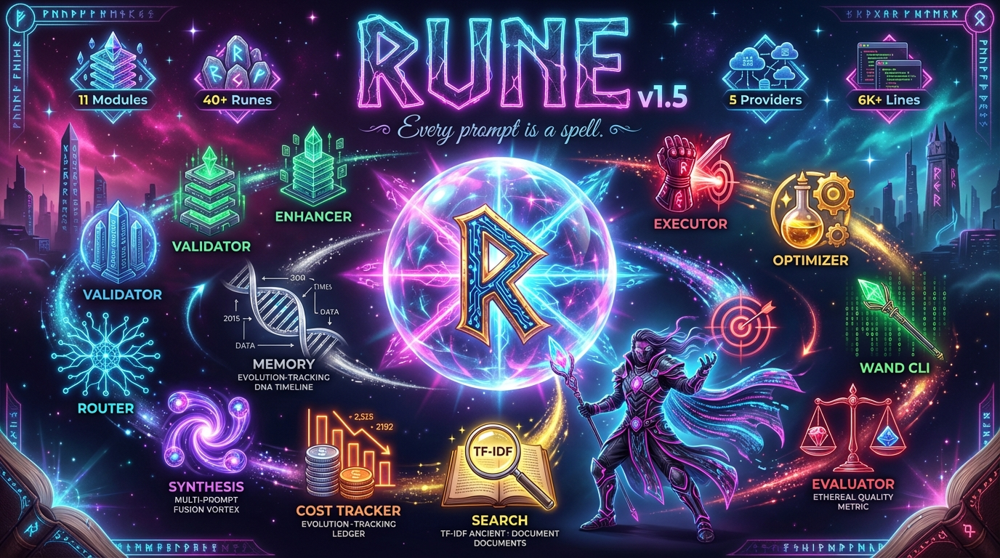
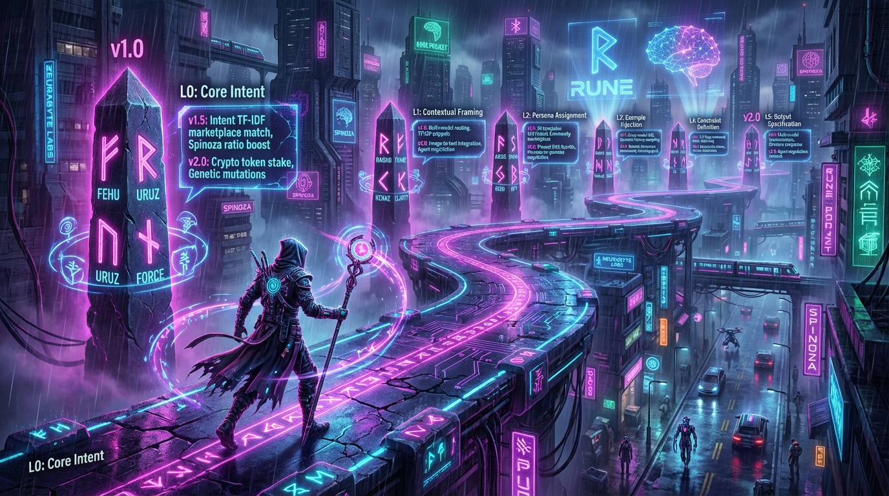

<div align="center">

# ᚱ RUNE

**Every prompt is a spell.**

*Where Spinoza Meets Silicon*

A structured 8-layer prompt engineering framework with philosophical validation, multi-prompt synthesis, and cost-aware model routing for high-fidelity LLM outputs.


[](LICENSE)
[](docs/CHANGELOG.md)
[](#-supported-models)
[](#-prompt-library-grimoire)

[Quick Start](#-quick-start) · [Architecture](#-architecture) · [New in v1.5](#-whats-new-in-v15) · [Models](#-supported-models) · [Grimoire](#-prompt-library-grimoire) · [Benchmarks](#-benchmarks) · [Roadmap](#-roadmap) · [Contributing](CONTRIBUTING.md)

<br>



*11 Modules · 40+ Runes · 5 Providers · 6K+ Lines of Code*

</div>

---

## What is RUNE?

Most prompts are flat text — unstructured, ambiguous, and inconsistent across models. **RUNE** is a layered prompt engineering framework that tells LLMs *exactly* how to think, respond, and self-correct — then validates outputs through a Spinoza-inspired philosophical lens.

RUNE wraps your intent in **8 semantic layers** — from identity and constraints to cognitive reasoning and output formatting. Every output passes through the **Spinoza Validator**: four philosophical pillars (Conatus, Ratio, Laetitia, Natura) scoring coherence, reasoning, positivity, and naturalness.

The result: outputs that are structured, reproducible, and dramatically higher quality across any frontier model.

### Why RUNE?

| Traditional Prompting | RUNE |
|---|---|
| "Write me a blog post" | 8-layer structured directive with persona, constraints, reasoning strategy, and output spec |
| Hope the model gets it right | Spinoza Validator scores every output (A–F grade) |
| One model, one prompt | Multi-model routing picks the best model for your task |
| Each prompt starts from scratch | MEMORY tracks evolution, SYNTHESIS fuses multiple prompts |
| No idea what it costs | Cost Tracker shows per-model spend in real-time |

> *"A prompt without structure is a spell without a wand."*

---

## 🆕 What's New in v1.5

| Module | Description |
|--------|-------------|
| 🧬 **SYNTHESIS** | Multi-prompt fusion — combine 2+ prompts into one with `layered`, `merged`, or `chain` strategies |
| 🧠 **MEMORY** | Persistent prompt evolution tracking — every cast is recorded, best prompts surface automatically |
| 💰 **COST TRACKER** | Per-model cost analytics with daily reports — know exactly what you're spending |
| 📚 **GRIMOIRE+** | 40+ prompt templates across 5 categories (Coding, Writing, Analysis, Creative, AI/ML) |
| 🌍 **TURKISH SUPPORT** | Spinoza Validator now scores Turkish prompts accurately (was F, now A) |
| ⚙️ **`wand config`** | View current configuration at a glance |
| 🔗 **`wand fuse`** | Fuse multiple prompts from files or stdin |
| 💸 **`wand cost`** | Detailed cost breakdown by model and day |

---

## ⚡ Quick Start

```bash
# Clone
git clone https://github.com/neurabytelabs/rune.git
cd rune

# No external dependencies required (pure Python 3.11+)
# Optional: pip install requests  (for LLM API calls)

# Configure your API
mkdir -p ~/.rune
cat > ~/.rune/config.toml << EOF
[llm]
api_url = "https://api.x.ai/v1/chat/completions"
api_key = "your-xai-api-key"
default_model = "grok-4-1-fast-reasoning"
timeout = 120
max_tokens = 8000
EOF

# Cast your first spell
python3 wand.py cast "Write a REST API for a todo app"

# See the enhanced prompt without executing
python3 wand.py inscribe "Optimize this React component"

# A/B compare: raw vs enhanced
python3 wand.py duel "Debug this memory leak"

# Fuse multiple prompts together (NEW in v1.5)
python3 wand.py fuse security.txt performance.txt testing.txt --strategy layered

# Check your spending (NEW in v1.5)
python3 wand.py cost

# Browse the grimoire
python3 wand.py grimoire

# Validate any text with Spinoza
python3 wand.py validate "Your LLM output here"

# View config
python3 wand.py config
```

### Configuration Options

```toml
[general]
version = "1.5.0"
template_version = "v4.3"
color = true

[llm]
# xAI Grok (recommended — fast, cheap, 2M context)
api_url = "https://api.x.ai/v1/chat/completions"
api_key = "your-key"
default_model = "grok-4-1-fast-reasoning"

# Or Google Gemini
# api_url = "https://generativelanguage.googleapis.com/v1beta"
# default_model = "gemini-3-pro"

# Or via Antigravity Gateway (local proxy, 60+ models)
# api_url = "http://127.0.0.1:8045/v1/chat/completions"

[spinoza]
enabled = true
threshold = 0.6

[paths]
db_path = "~/.rune/history.db"
```

---

## 🤖 Supported Models

| Provider | Model | Best For | Cost (per 1M tokens) |
|----------|-------|----------|---------------------|
| **xAI** | Grok 4.1 Fast Reasoning | General purpose, fast | $0.20 / $0.50 |
| **xAI** | Grok Code Fast | Code generation | $0.20 / $1.50 |
| **Google** | Gemini 3 Pro | Template compliance, structured output | $1.25 / $10 |
| **Google** | Gemini 3 Flash | Quick tasks, high volume | $0.15 / $0.60 |
| **Anthropic** | Claude Opus 4 | Deep reasoning, long-form writing | $15 / $75 |
| **Anthropic** | Claude Sonnet 4.5 | Balanced quality | $3 / $15 |
| **OpenAI** | GPT-4o | Multimodal, balanced | $5 / $15 |
| **OpenAI** | GPT-o3 | Math, logic, complex reasoning | $10 / $40 |

Use `--model` flag or set `default_model` in config.

---

## 🏗 Architecture

<div align="center">


*The 8-layer enhancement engine with orchestrator wizard conducting energy flows*

</div>

```
┌──────────────────────────────────────────────────────┐
│                   RUNE v1.5                          │
│            "Every prompt is a spell"                 │
├──────────────────────────────────────────────────────┤
│                                                      │
│  🪄 WAND CLI (12 commands)                           │
│  cast · inscribe · duel · fuse · grimoire           │
│  validate · forge · test · stats · cost · config    │
│                                                      │
├──────────────────────────────────────────────────────┤
│                                                      │
│  📜 8-LAYER ENHANCER                                 │
│  L0 System Core ──── Role, mode, temporal anchor     │
│  L1 Context ──────── Domain, persona, expertise      │
│  L2 Intent ──────── Objective, scope, boundaries     │
│  L3 Governance ──── Constraints, ethics, guardrails  │
│  L4 Cognitive ────── CoT, ToT, reasoning depth       │
│  L5 Capabilities ── Tools, APIs, domain knowledge    │
│  L6 QA ──────────── Self-check, validation, retry    │
│  L7 Output ──────── Format, language, observability  │
│                                                      │
├──────────────────────────────────────────────────────┤
│                                                      │
│  🧬 SYNTHESIS        Fuse multiple prompts           │
│  🧠 MEMORY           Track prompt evolution          │
│  🔀 ROUTER           Multi-model task routing        │
│  🔍 SEARCH           TF-IDF prompt library search    │
│  🧪 EVALUATOR        Cross-model A/B testing         │
│  💰 COST TRACKER     Per-model spend analytics       │
│                                                      │
├──────────────────────────────────────────────────────┤
│                                                      │
│  🔮 SPINOZA VALIDATOR                                │
│  ├── Conatus   — Drive, growth, persistence          │
│  ├── Ratio     — Logic, structure, reasoning         │
│  ├── Laetitia  — Positivity, clarity, joy            │
│  └── Natura    — Coherence, flow, naturalness        │
│                                                      │
│  Supports: English 🇬🇧 + Turkish 🇹🇷                   │
│  Grade: A (≥0.85) · B (≥0.70) · C (≥0.55) · D · F  │
│                                                      │
└──────────────────────────────────────────────────────┘
```

---

## ✨ Features

| | Feature | Description |
|---|---|---|
| 🎯 | **8-Layer Structure** | Semantic separation of concerns for prompts |
| 🔮 | **Spinoza Validator** | 4-pillar philosophical validation (EN + TR) |
| 🧬 | **SYNTHESIS** | Fuse multiple prompts into one (layered/merged/chain) |
| 🧠 | **MEMORY** | Track prompt evolution, surface best performers |
| 💰 | **Cost Tracker** | Real-time per-model cost analytics |
| 🔀 | **Smart Routing** | Auto-route tasks to the optimal model |
| 🔄 | **Polyglot** | Auto-detects language, responds accordingly |
| 🏷️ | **Domain Presets** | CODING / WRITING / ANALYSIS / CREATIVE / AI_ML |
| 📊 | **Complexity Scaling** | L1–L5 auto-adjusts layer depth |
| 🧪 | **Cross-Model Testing** | Benchmark prompts across multiple LLMs |
| 📚 | **Grimoire** | 40+ production-ready prompt templates |
| 👁️ | **Observability** | Active layer tracking + cost per call |

---

## 📚 Prompt Library (Grimoire)

40+ ready-to-use runes across 5 categories:

### 💻 Coding
| # | Rune | Use Case |
|---|------|----------|
| 01 | [🔮 Shader Debug](prompts/01_shader_debug.md) | WebGL/GLSL diagnostics |
| 05 | [🔍 Code Review](prompts/05_code_review.md) | Deep code analysis |
| 07 | [🔧 Refactoring](prompts/07_refactoring.md) | Safe code restructuring |
| 08 | [🧪 Test Generation](prompts/08_test_generation.md) | Test scenario creation |
| 11 | [🌐 REST API Design](prompts/11_coding_api_design_rest.md) | API architecture |
| 12 | [🔒 Security Review](prompts/12_coding_code_review_security.md) | Security-focused review |
| 13 | [🐛 Systematic Debug](prompts/13_coding_debug_systematic.md) | Methodical debugging |
| 14 | [🏗️ Architecture](prompts/14_coding_architecture_design.md) | System design |
| 15 | [💾 DB Schema](prompts/15_coding_database_schema.md) | Database design |

### 📝 Writing & Analysis
| # | Rune | Use Case |
|---|------|----------|
| 02 | [🎨 UI/UX Polish](prompts/02_ui_polish.md) | Interface refinement |
| 03 | [⚡ Performance Audit](prompts/03_performance_audit.md) | Optimization |
| 04 | [🗺️ Feature Roadmap](prompts/04_feature_roadmap.md) | Planning |
| 06 | [🐛 Bug RCA](prompts/06_bug_rca.md) | Root cause analysis |
| 09 | [🌐 API Docs](prompts/09_api_design.md) | REST/GraphQL docs |
| 10 | [📚 Documentation](prompts/10_documentation.md) | Technical writing |

### 🎨 Visual & Creative
| # | Rune | Use Case |
|---|------|----------|
| 🖼️ | [RUNE Infographic](prompts/rune_infographic_visual.md) | Framework visualization |

> Browse all: `wand grimoire` or see [prompts/](prompts/)

---

## 📊 Benchmarks

Cross-model testing with `wand test`:

| Model | Template Compliance | Output Quality | Structured Output | Cost Efficiency |
|-------|:------------------:|:--------------:|:-----------------:|:---------------:|
| Gemini Flash 🥇 | ⭐⭐⭐⭐⭐ | ⭐⭐⭐⭐ | ⭐⭐⭐⭐⭐ | ⭐⭐⭐⭐⭐ |
| Grok 4.1 Fast 🥈 | ⭐⭐⭐⭐ | ⭐⭐⭐⭐⭐ | ⭐⭐⭐⭐ | ⭐⭐⭐⭐⭐ |
| GPT-4o 🥉 | ⭐⭐⭐⭐ | ⭐⭐⭐⭐⭐ | ⭐⭐⭐⭐ | ⭐⭐⭐ |
| Gemini Pro | ⭐⭐⭐⭐ | ⭐⭐⭐⭐ | ⭐⭐⭐⭐ | ⭐⭐⭐⭐ |
| Claude Sonnet | ⭐⭐⭐ | ⭐⭐⭐⭐⭐ | ⭐⭐⭐ | ⭐⭐⭐ |
| Claude Opus | ⭐⭐⭐ | ⭐⭐⭐⭐⭐ | ⭐⭐⭐ | ⭐⭐ |

> **Key insight:** Smaller models follow structured templates better. Claude excels at prose but tends to ignore XML. Grok 4.1 offers the best quality-per-dollar. See [full benchmarks →](docs/BENCHMARKS.md)

---

## 🛠 CLI Reference (WAND)

```bash
# Core
wand cast "prompt"                    # Enhance + execute via LLM
wand inscribe "prompt"                # Show enhanced prompt only
wand duel "prompt"                    # A/B: raw vs enhanced

# Synthesis (v1.5)
wand fuse f1.txt f2.txt               # Fuse prompts (default: layered)
wand fuse f1.txt f2.txt -s merged     # Merge strategy
wand fuse f1.txt f2.txt -s chain      # Chain strategy

# Library
wand grimoire                         # Browse prompt library
wand forge                            # Create new rune template

# Validation
wand validate "text"                  # Spinoza validation (A-F grade)
wand test                             # Cross-model benchmark

# Analytics (v1.5)
wand stats                            # Usage + evolution stats
wand cost                             # Cost breakdown by model
wand config                           # Show current configuration

# Meta
wand version                          # Version + config info
```

---

## 🗺️ Roadmap

<div align="center">



*The wizard's journey from v1.0 to v2.0 — each rune stone activates new powers*

</div>

### v1.5 ✅ (Current)
- [x] SYNTHESIS — Multi-prompt fusion
- [x] MEMORY — Prompt evolution tracking
- [x] Cost Tracker — Per-model analytics
- [x] Turkish Spinoza Validator
- [x] 40+ prompt templates
- [x] xAI/Grok integration

### v2.0 (Planned)
- [ ] 🔮 **ORACLE** — Self-improving prompts via feedback loops
- [ ] 🐝 **SWARM** — Multi-agent prompt orchestration
- [ ] 🧬 **Prompt DNA** — Genetic algorithm prompt evolution
- [ ] 🏪 **Marketplace** — Community prompt sharing & rating
- [ ] 🖼️ **Visual Pipeline** — Text-to-image prompt engineering
- [ ] 🤝 **Agent Negotiation** — Agent-to-agent prompt collaboration

> See [ROADMAP_IDEAS.md](docs/ROADMAP_IDEAS.md) for the full vision.

---

## 🤝 Contributing

We welcome contributions! See [CONTRIBUTING.md](CONTRIBUTING.md) for guidelines.

- 🐛 [Report a bug](.github/ISSUE_TEMPLATE/bug_report.md)
- 💡 [Request a feature](.github/ISSUE_TEMPLATE/feature_request.md)
- 📝 [Submit a rune](.github/ISSUE_TEMPLATE/new_prompt.md)

## 📄 License

[MIT](LICENSE) © 2026 [NeuraByte Labs](https://neurabytelabs.com) / [Mustafa Saraç](https://github.com/mrsarac)

---

<div align="center">

**[GitHub](https://github.com/neurabytelabs/rune)** · **[Twitter](https://twitter.com/00xmorty)** · **[NeuraByte Labs](https://neurabytelabs.com)**

*Where Spinoza Meets Silicon* ᚱ

<sub>If RUNE helped you craft better prompts, consider giving it a ⭐</sub>

</div>
