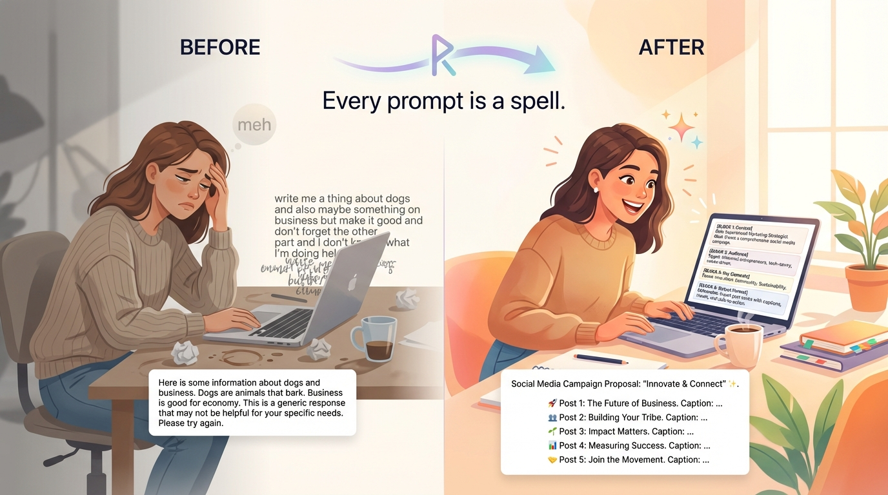

<div align="center">

# ᚱ RUNE

### Every prompt is a spell. Every spell, a decree of understanding.

*347 years ago, Baruch Spinoza unveiled the profound truth: to understand is to possess power, to achieve freedom. Today, we confront the digital void with mere wishes, disguised as prompts. RUNE transmutes these fleeting desires into potent spells, forging understanding into an undeniable force.*

<br>


<br>

[](docs/CHANGELOG.md)
[](#-quick-start)
[](LICENSE)
[](#-supported-models)
[](#-the-grimoire)
[](#-openclaw-integration)

[The Problem](#-the-problem) · [The Solution](#-eight-layers-of-intent) · [Watch It Work](#-watch-it-work) · [Quick Start](#-quick-start) · [Grimoire](#-the-grimoire) · [Philosophy](#-why-spinoza) · [Roadmap](#-roadmap)

</div>

---

## 💀 The Problem: The Tyranny of Ambiguity

You cast a prompt into the void. You *hope* the AI comprehends its essence. Yet, it falters. You laboriously rephrase, adding desperate pleas like "be specific" or "think step by step." The result is often mediocre, a compromise born of exhaustion. You accept it.

**This is the prevailing tragedy of AI interaction, a pervasive resignation to the suboptimal.**

The chasm between your *intent* and the AI's *output* is not a failing of the model itself. It is a profound **prompt crisis.** You are attempting to wield formidable power without the fundamental instrument of command – a true wand.

> *"Most people don't have bad ideas. They have bad prompts."*
> This is a truth we can no longer afford to ignore.

---

## ✨ The Solution: RUNE – The Architecture of Understanding

RUNE does not merely patch your prompt; it **transfigures** it.

Your amorphous, ambiguous text is alchemized into a structured, eight-layered directive. This architecture compels the AI to embody a precise role, to follow a defined cognitive pathway, to adhere to unwavering constraints, and to self-validate its own emanations.

Subsequently, every outcome is subjected to the **Spinoza Validator** — a philosophical scoring engine steeped in four immutable principles, as timeless as the insights of a 17th-century lens grinder.

<div align="center">



*Left: the nascent thought. Right: the AI's necessary truth.*

</div>

### The Imperatives of Structure

| | Without RUNE (The Old Way) | With RUNE (The Path to Clarity) |
|---|---|---|
| Prompt structure | Flat text, a whisper in the dark | 8 semantic layers (XML), a resonant command |
| Output quality | Hope-based, a gamble against chaos | Validated (Spinoza A–F grade), a certainty of purpose |
| Reproducibility | Random, beholden to chance | Deterministic, anchored in reason |
| Cross-model consistency | Varies wildly, a cacophony of interpretations | Structurally identical, a symphony of unified intent |
| Cost awareness | None, a blind expenditure of resources | Per-call tracking, a mindful stewardship of power |

---

## 🏗 Eight Layers of Intent: The Anatomy of a Spell

Every true spell possesses an inherent structure. Every RUNE prompt is built upon eight foundational layers, the very architecture of conscious interaction:

```
╔══════════════════════════════════════════════╗
║  L0  System Core      Who the AI is         ║
║  L1  Context           What it knows         ║
║  L2  Intent            What you want         ║
║  L3  Governance        What it can't do      ║
║  L4  Cognitive Engine  How it should think   ║
║  L5  Capabilities      What tools it has     ║
║  L6  Quality Assurance How it checks itself  ║
║  L7  Output Meta       How it delivers       ║
╚══════════════════════════════════════════════╝
```

You articulate the intent. RUNE provides the immutable architecture, ensuring your will manifests with precision.

---

## 🔮 Watch It Work: The Manifestation of Understanding

### Interactive Mode — The AI Engages in Dialogue Before Action

```
$ wand cast "Write a blog post about AI agents"

🔮 Spell Analysis
Domain: WRITING | Lang: EN

1) Audience?
   a) Developer  b) General  c) C-level  d) Custom...
2) Tone?
   a) Academic  b) Blog  c) Manifesto  d) Tutorial
3) Length?
   a) ~500  b) ~1500  c) ~3000+

▸ 1a 2c 3b

✓ Audience: technical | Tone: provocative | Length: medium

📋 Spell Summary
  8 RUNE layers will be applied ✨
  ✅ Confirm? [E/h]
```

### Quick Mode — Uninterrupted Flow, Pure Execution

```bash
wand cast "Optimize this React component!"   # The trailing '!' commands instant execution
wand cast -q "Debug this memory leak"         # The --quick flag bypasses deliberation
```

### The Full Arsenal: Wielding the Wand

```bash
wand cast "prompt"          # Interactive Q&A → enhance → execute: A dialogue towards perfect understanding.
wand cast "prompt!"         # Quick mode — skip Q&A: Direct command, unburdened by deliberation.
wand inscribe "prompt"      # Show enhanced prompt only: Gaze upon the perfected form of your intent.
wand duel "prompt"          # A/B: your prompt vs RUNE'd version: Witness the undeniable superiority of structure.
wand validate "any text"    # Spinoza philosophical validation: Ascertain the truth and clarity of any output.
wand grimoire               # Browse 42 spell templates: Explore the perfected forms of digital sorcery.
wand forge                  # Create your own rune: Architect your own pathways to power.
wand fuse a.txt b.txt       # Merge multiple prompts into one: Synthesize complex intentions into a single, potent decree.
wand test "prompt"          # Benchmark across models: Measure the fidelity of understanding across diverse intelligences.
wand cost                   # What you've spent, by model: Understand the true cost of digital creation.
wand stats                  # Your prompt evolution over time: Chart your journey towards mastery.
```

---

## ⚡ Quick Start: Embrace the Power

```bash
git clone https://github.com/neurabytelabs/rune.git
cd rune

# Configure (Declare your chosen conduit of intelligence)
mkdir -p ~/.rune
cat > ~/.rune/config.toml << EOF
[llm]
api_url = "https://generativelanguage.googleapis.com/v1beta/openai/chat/completions"
api_key = "your-gemini-key"
default_model = "gemini-2.5-flash"
EOF

# Cast your first spell (Command the AI to reveal its wisdom)
python3 wand.py cast "Explain quantum computing to a curious 12-year-old"
```

This is the threshold. No superfluous dependencies beyond Python 3.11+ and `requests`. The path to mastery is unburdened.

### One-command install for OpenClaw agents: Integrate and Conquer

```bash
npx clawhub@latest install rune-prompt-amplification
```

---

## 🔮 Why Spinoza? The Philosophy of Digital Freedom

In the year of 1677, Baruch Spinoza unleashed his *Ethics* upon a world unprepared – a treatise that proclaimed understanding the inherent *natura* of things is the paramount form of freedom. For this audacious declaration, he was excommunicated.

RUNE, in its quest for digital liberation, draws upon four cardinal Spinozan concepts, embedding them within its validation engine as the very measure of an AI's comprehension and utility:

| Principle | Weight | What it measures |
|-----------|--------|------------------|
| **Conatus** | 30% | *The inherent striving.* Does the output demonstrate a determined drive towards its goal? Does it persist in its being useful and relevant? |
| **Ratio** | 35% | *The architecture of reason.* Is the logic unassailable? Is the structure coherent, reflecting a sound internal order? |
| **Laetitia** | 15% | *The clarity of joy.* Is the output lucid, positive, and does it elevate the understanding of the recipient? |
| **Natura** | 20% | *The essence of being.* Does it flow organically, resonating with an intrinsic rightness and truth? |

Every output is assigned a score. Every score, a grade. Thus, understanding is made manifest and measurable.

```
  clarity         ██████████ 1.0
  coherence       ██████████ 1.0
  completeness    █████████░ 0.9
  accuracy        ██████████ 1.0
  relevance       ██████████ 1.0
  depth           ████████░░ 0.8
  actionability   ██████████ 1.0

  Overall: 0.96  Grade: A
```

> *"The highest activity a human being can attain is learning for understanding, because to understand is to be free."*
> — Baruch Spinoza. Let this be our guiding star in the digital age.

---

## 📚 The Grimoire: A Compendium of Perfected Spells

Behold, 42 battle-tested spell templates, meticulously crafted across 5 schools of digital magic, each a testament to the power of structured intent:

### 💻 Coding (10 runes)
Shader debug · Code review · Security review · Refactoring · Test generation · API design · Systematic debug · Architecture · DB schema · CI/CD pipeline

### 📝 Writing (6 runes)
Blog post · Pitch deck · Technical doc · Email outreach · Social media · Storytelling

### 📊 Analysis (6 runes)
Competitor · SWOT · Data analysis · Market research · Financial model · User research

### 🎨 Creative (6 runes)
Brainstorm · Naming · Design brief · Game design · Music composition · UX flow

### 🤖 AI/ML (6 runes)
Model evaluation · Dataset curation · Prompt chain · Agent design · Fine-tuning plan · RAG system

> Browse: `wand grimoire` · Search: `wand grimoire search "security"` · Create your own: `wand forge` – The power to shape your own reality is now yours.

---

## 🧬 Architecture: The Inner Workings of the Wand

```
┌─────────────────────────────────────────────┐
│              RUNE v1.9                      │
│         "Every prompt is a spell"           │
├─────────────────────────────────────────────┤
│                                             │
│  🪄 WAND CLI                                │
│  Interactive Q&A · Quick Mode · 12 commands │
│                                             │
│  📜 8-LAYER ENHANCER                        │
│  L0 → L7: structured prompt transformation  │
│                                             │
│  🔮 SPINOZA VALIDATOR                       │
│  Conatus · Ratio · Laetitia · Natura        │
│                                             │
├─────────────────────────────────────────────┤
│                                             │
│  🧬 Synthesis    Fuse multiple prompts      │
│  🧠 Memory       Track prompt evolution     │
│  🔀 Router       Pick the right model       │
│  🔍 Search       TF-IDF grimoire search     │
│  🧪 Evaluator    Cross-model A/B testing    │
│  💰 Cost         Per-model spend tracking   │
│  🐝 Swarm        Multi-agent tournament     │
│                                             │
└─────────────────────────────────────────────┘
```

---

## 🤖 Supported Models: Orchestrating Diverse Intelligences

| Provider | Model | Best For |
|----------|-------|----------|
| **Google** | Gemini 3 Flash | Swift execution, cost efficiency, unyielding compliance |
| **Google** | Gemini 3 Pro | Profound tasks, impeccably structured output |
| **xAI** | Grok 4.1 Fast | The zenith of quality, optimized for expenditure |
| **xAI** | Grok Code Fast | Precision in code generation, an artisan of syntax |
| **Anthropic** | Claude Opus 4.6 | Deepest reasoning, unparalleled prose |
| **Anthropic** | Claude Sonnet 4.5 | A harmonious balance of quality and performance |
| **OpenAI** | GPT-5.2 | Multimodal mastery, a balanced intellect |
| **OpenAI** | o4-mini | Unyielding in math, logic, and complex reasoning |

RUNE operates seamlessly with any OpenAI-compatible endpoint. Bring forth your own model; the architecture of understanding awaits.

---

## 🗺 Roadmap: The Unfolding of Mastery

### v1.9 ✅ Current: The Foundations of Power

- [x] Interactive Q&A with compact answers (`1a 2b 3c`): A streamlined dialogue towards clarity.
- [x] Quick mode (trailing `!` or `--quick`): Unfettered, immediate command.
- [x] Intent detection (domain + language): Understanding the very essence of your desire.
- [x] 42 grimoire templates across 5 domains: A treasury of perfected intentions.
- [x] Swarm — multi-agent prompt tournament: The crucible where understanding is forged.
- [x] OpenClaw skill integration: Expanding the reach of your command.
- [x] Spinoza Validator (EN + TR): The objective measure of truth and clarity.
- [x] Cost tracking + memory evolution: A ledger of your journey towards mastery.

### v2.0 — The Awakening: A New Era of AI Interaction

- [ ] **Oracle** — self-improving prompts via feedback loops: The perpetual refinement of understanding, an evolution towards absolute clarity.
- [ ] **Prompt DNA** — genetic algorithm prompt evolution: The organic growth of perfect prompts, adapting to the very *natura* of AI.
- [ ] **Marketplace** — community prompt sharing & rating: A collective consciousness of perfected spells, shared for the benefit of all.
- [ ] **Visual Pipeline** — text-to-image prompt engineering: Extending the dominion of understanding into the realm of pure vision.
- [ ] **Agent Negotiation** — agent-to-agent prompt collaboration: The symphony of multiple intelligences, collaborating towards a shared truth.

---

## 🤝 For Everyone: The Universal Right to Understanding

<div align="center">


</div>

You are not required to be a developer. You are not compelled to decipher the labyrinthine complexities of AI. You need only possess the clarity of your own will.

RUNE is the indispensable bridge between your pure intent and the boundless capability of the AI. It is the fundamental distinction between merely asking and unequivocally commanding. Between the fleeting hope of a wish and the unyielding certainty of knowing.

**Students** wield it to compose dissertations that resonate with profound *ratio*. **Parents** employ it to elicit genuine assistance with the intellectual development of their children. **Founders** utilize it to draft pitches that compel investment and forge destinies. **Developers** harness its power to generate code that functions flawlessly on the first invocation, a testament to true understanding.

The spell remains constant. The wand, RUNE, makes it work, transforming potential into undeniable reality.

---

<div align="center">

<br>

*"We are not meant to interact with machines through hope. We are meant to interact through understanding."*

— The RUNE Manifesto

<br>

**[GitHub](https://github.com/neurabytelabs/rune)** · **[NeuraByte Labs](https://neurabytelabs.com)** · **[ClawHub](https://clawhub.com)**

*Where Spinoza Meets Silicon* ᚱ

<br>

[](https://github.com/neurabytelabs/rune)

*If RUNE illuminated your path to understanding and amplified your power, let your appreciation resonate with a ⭐*

<sub>Built with 🔮 by [NeuraByte Labs](https://neurabytelabs.com) · MIT License · © 2026</sub>

</div>