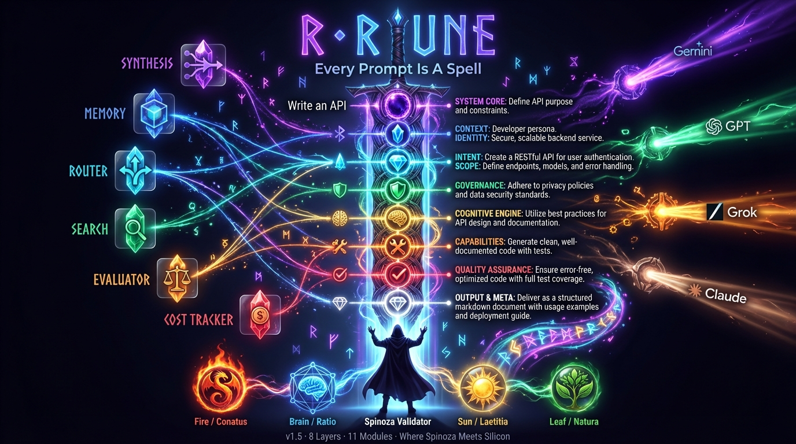
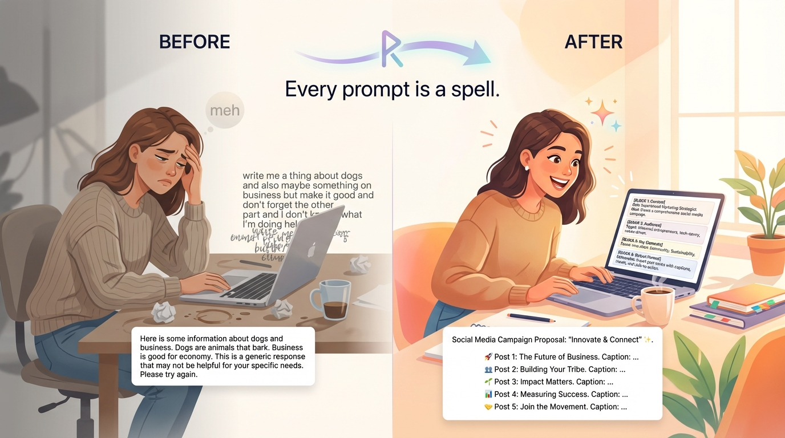
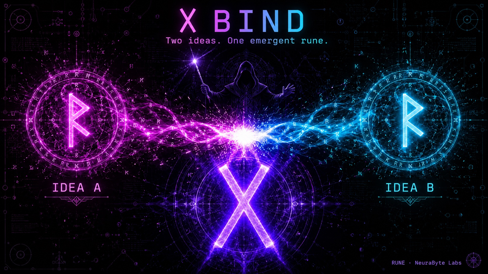

<div align="center">

# RUNE

### 8-layer prompt amplification framework with a blind A/B benchmark harness

**Structured prompts, measured against raw prompts.**

*RUNE restructures prompts into 8 layers, ships a blind pairwise A/B harness, and in our own pilot (50 pairs, 2 Gemini models) amplified prompts were preferred in 19.6% of decided pairs, i.e. they lost. Read [the benchmark numbers and limits](docs/BENCHMARKS.md).*

Status / limits: this pilot covers 50 pairs on the tested prompts and Gemini models; results do not generalize beyond those prompts or models.

<br>



<br>

[](docs/CHANGELOG.md)
[](#quick-start)
[](LICENSE)
[](docs/BENCHMARKS.md)
[](#templates)
[](#openclaw-install)

[The Problem](#the-problem) · [How it works](#how-it-works) · [Eight layers](#eight-layers) · [Usage](#usage) · [Quick Start](#quick-start) · [Templates](#templates) · [Validator](#spinoza-validator) · [Roadmap](#roadmap)

</div>

---

## The Problem

Prompt quality is hard to reason about when the only workflow is to rewrite by instinct and compare outputs informally. Small wording changes can improve one task and hurt another, and it is easy to overfit to a single example.

**RUNE treats prompt rewriting as something to structure and test, not something to assume.**

The project is useful only if its structure survives measurement. The current benchmark result is negative for the tested prompt set and models, which is why the benchmark harness is part of the first impression rather than an appendix.

---

## How it works

RUNE rewrites a flat, ambiguous prompt into a structured, eight-layer directive. The layers tell the model which role to take, how to reason, which constraints apply and how to check its own output.

Each result can then be scored by the **Spinoza Validator**, a heuristic scoring step based on four concepts from Spinoza's *Ethics* (see [Spinoza Validator](#spinoza-validator)).

<div align="center">



*Left: the original request. Right: the structured version.*

</div>

### What changes

| | Without RUNE | With RUNE |
|---|---|---|
| Prompt structure | Flat text | 8 semantic layers (XML) |
| Output scoring | None | Spinoza A–F grade (heuristic; not a measure of answer quality, see [benchmark](docs/BENCHMARKS.md)) |
| Prompt format across models | Whatever you write | The same layer structure for every model |
| Cost tracking | None | Per-call, per-model tracking |

---

## Eight layers

Every RUNE prompt is built from eight layers:

```
╔══════════════════════════════════════════════╗
║  L0  System Core      Who the AI is         ║
║  L1  Context           What it knows         ║
║  L2  Intent            What you want         ║
║  L3  Governance        What it can't do      ║
║  L4  Cognitive Engine  How it should think   ║
║  L5  Capabilities      What tools it has     ║
║  L6  Quality Assurance How it checks itself  ║
║  L7  Output Meta       How it delivers       ║
╚══════════════════════════════════════════════╝
```

You write the intent. RUNE fills in the other layers.

---

## Usage

### Interactive mode: questions before the prompt is built

```
$ wand cast "Write a blog post about AI agents"

Analysis
Domain: WRITING | Lang: EN

1) Audience?
   a) Developer  b) General  c) C-level  d) Custom...
2) Tone?
   a) Academic  b) Blog  c) Manifesto  d) Tutorial
3) Length?
   a) ~500  b) ~1500  c) ~3000+

> 1a 2c 3b

Audience: technical | Tone: provocative | Length: medium

Summary
  8 RUNE layers will be applied
  Confirm? [E/h]
```

### Quick mode: no questions

```bash
wand cast "Optimize this React component!"   # A trailing '!' skips the questions
wand cast -q "Debug this memory leak"         # --quick does the same
```

### All commands

```bash
wand cast "prompt"          # Interactive Q&A, then enhance and execute
wand cast "prompt!"         # Quick mode, skip Q&A
wand inscribe "prompt"      # Show the enhanced prompt only
wand duel "prompt"          # A/B: your prompt vs the RUNE version
wand validate "any text"    # Spinoza validation of any text
wand grimoire               # Browse the 42 templates
wand forge                  # Create your own template
wand fuse a.txt b.txt       # Merge several prompts into one
wand bind "A" "B"           # Combine two ideas into one new template
wand lineage --export-gepa run.json  # Export prompt history for GEPA-viz
wand test "prompt"          # Run a prompt across models
wand cost                   # Spend by model
wand stats                  # Prompt history over time
```

The command names (`wand`, `grimoire`, `forge`, `inscribe`) are the CLI's real identifiers and are kept for compatibility.

---

## Bind

<div align="center">



*Two ideas in, one new template out.*

</div>

`fuse` places two prompts side by side. `bind` takes two raw ideas and generates a **third template** built from the tension between them. The result is Spinoza-scored and saved to your template library.

```bash
wand bind "minimalism" "CRM dashboard"     # a template neither idea gives alone
wand bind "rune" "rune"                     # bind RUNE with itself
wand bind "silence" "blockchain" --dry      # preview without saving
```

### Example: `rune ⊕ rune`

Binding RUNE with itself produced a template that generates other templates:

```
rune  ⊕  rune

tension: "The absolute singularity of a discrete instruction fractures when
          forced to recursively define itself, birthing a generative syntax."

# The Metaglyph                                       Spinoza: 0.94
# Category: AIML · Complexity: L5
# A recursive architect that analyzes raw intent to forge, structure,
# and optimize other system prompts.

  L1 Identity   → "the prime architect of cognitive instructions… you forge
                   the linguistic machinery, you do not perform the task"
  L4 Methodology → Deconstruction → Architecture → Inscription
  L6 Errors      → Recursion Failure: executing the task instead of building
                   the prompt for it
```

The result, "The Metaglyph", is a template that builds other templates. That is the difference between `fuse` and `bind`.

---

## Lineage

RUNE records prompt ancestry when you run `wand cast`. You can export it as a **GEPA-viz-compatible `run.json`** and inspect the candidate tree visually.

GEPA-viz is not a dependency of RUNE. The export covers prompt candidates, parent links, Spinoza scores, refinement rounds, model metadata and feedback.

```bash
# Run prompts as usual; RUNE records lineage under ~/.rune/lineage
wand cast -q "Turn this rough product idea into a launch brief!"

# List recent lineage records
wand lineage

# Export recent lineage for visual inspection
wand lineage --limit 25 --export-gepa run.json

# Optional upstream viewer path: run GEPA-viz separately and load run.json
# Keep this outside RUNE's runtime dependency chain.

# Zero-install local demo included in this repo
open demo/gepa-lineage/index.html
```

Sample candidate trees:

- [`demo/gepa-lineage/`](demo/gepa-lineage/): compact prompt-evolution walkthrough.
- [`demo/agent-cron-lineage/`](demo/agent-cron-lineage/): staged Hermes Agent Mesh + cronjob operating-loop demo.

Lineage shows which prompt form changed, why, and whether the score changed with it. Use it for important prompt systems: releases, agent-role prompts, recurring cron briefs and automation guardrails. Do not graph every small prompt.

---

## Quick Start

```bash
# Option A: pip install (recommended)
pip install rune-wand
wand cast "Explain quantum computing to a curious 12-year-old"

# Option B: from source
git clone https://github.com/neurabytelabs/rune.git
cd rune
python wand.py cast "Explain quantum computing to a curious 12-year-old"
```

```bash
# Configure your LLM provider
mkdir -p ~/.rune
cat > ~/.rune/config.toml << EOF
[llm]
api_url = "https://generativelanguage.googleapis.com/v1beta/openai/chat/completions"
api_key = "your-api-key"
default_model = "gemini-3.1-pro-preview"
timeout = 300   # seconds — bump for deep-thinking models
EOF
```

Dependencies: Python 3.11+ and `requests` only.

### OpenClaw install

```bash
npx clawhub@latest install rune-prompt-amplification
```

---

## Spinoza Validator

The validator scores output with four concepts from Spinoza's *Ethics* (1677). It is a local heuristic: it checks structure and wording, not factual correctness.

| Principle | Weight | What it measures |
|-----------|--------|------------------|
| **Conatus** | 30% | Does the output keep pushing toward its goal and stay relevant? |
| **Ratio** | 35% | Is the logic coherent and the structure sound? |
| **Laetitia** | 15% | Is the output clear and easy to understand? |
| **Natura** | 20% | Does it read naturally and stay true to the task? |

Every output gets a score and a grade.

```
  clarity         ██████████ 1.0
  coherence       ██████████ 1.0
  completeness    █████████░ 0.9
  accuracy        ██████████ 1.0
  relevance       ██████████ 1.0
  depth           ████████░░ 0.8
  actionability   ██████████ 1.0

  Overall: 0.96  Grade: A
```

> *"The highest activity a human being can attain is learning for understanding, because to understand is to be free."*
> Baruch Spinoza

---

## Templates

42 templates across 5 domains. Each has YAML frontmatter metadata.

### Coding (10)
Shader debug · Code review · Security review · Refactoring · Test generation · API design · Systematic debug · Architecture · DB schema · CI/CD pipeline

### Writing (6)
Blog post · Pitch deck · Technical doc · Email outreach · Social media · Storytelling

### Analysis (6)
Competitor · SWOT · Data analysis · Market research · Financial model · User research

### Creative (6)
Brainstorm · Naming · Design brief · Game design · Music composition · UX flow

### AI/ML (6)
Model evaluation · Dataset curation · Prompt chain · Agent design · Fine-tuning plan · RAG system

> Browse: `wand grimoire` · Search: `wand grimoire search "security"` · Create your own: `wand forge`

---

## Architecture

```
┌─────────────────────────────────────────────┐
│                RUNE v2.x                    │
├─────────────────────────────────────────────┤
│  WAND CLI                                   │
│  Interactive Q&A · Quick Mode · 15 commands │
│                                             │
│  8-LAYER ENHANCER                           │
│  L0 → L7: structured prompt transformation  │
│                                             │
│  SPINOZA VALIDATOR                          │
│  Conatus · Ratio · Laetitia · Natura        │
├─────────────────────────────────────────────┤
│  Synthesis    Fuse multiple prompts         │
│  Bind         Combine 2 ideas -> 1 template │
│  Memory       Track prompt evolution        │
│  Router       Pick the right model          │
│  Search       TF-IDF template search        │
│  Evaluator    Cross-model A/B testing       │
│  Cost         Per-model spend tracking      │
│  Swarm        Multi-agent tournament        │
│  Oracle       Feedback-driven refinement    │
│  Lineage      Prompt ancestry tracking      │
│  Providers    Unified LLM interface         │
└─────────────────────────────────────────────┘
```

---

## Models

RUNE works with any OpenAI-compatible endpoint. Only two models have been tested in the blind benchmark:

| Provider | Model | Status |
|----------|-------|--------|
| Google | Gemini 3.1 Pro (default) | Used in the blind pilot ([results](docs/BENCHMARKS.md)) |
| Google | Gemini 3 Flash | Used in the blind pilot ([results](docs/BENCHMARKS.md)) |

Other providers (xAI Grok, Anthropic Claude, OpenAI GPT) can be configured through the OpenAI-compatible interface. We have not benchmarked them, so we make no claims about results on those models.

---

## Roadmap

### v1.9 (complete)

- [x] Interactive Q&A with compact answers (`1a 2b 3c`).
- [x] Quick mode (trailing `!` or `--quick`).
- [x] Intent detection (domain + language).
- [x] 42 templates across 5 domains.
- [x] Swarm — multi-agent prompt tournament.
- [x] OpenClaw skill integration.
- [x] Spinoza Validator (EN + TR).
- [x] Cost tracking + memory evolution.

### v2.0 (current)

- [x] **Modular architecture** — wand.py refactored from monolith to `rune/cli/` package.
- [x] **pyproject.toml** — pip-installable package (`rune-wand`).
- [x] **SpinozaValidator** — local heuristic validation, no LLM needed.
- [x] **Unified providers** — single interface for all OpenAI-compatible LLMs.
- [x] **Swarm integration** — `wand swarm` in main CLI.
- [x] **Oracle** — self-improving prompts via feedback loops; refines automatically when quality falls below a threshold.
- [x] **Prompt Lineage** — ancestry tracking for every enhanced prompt: `wand lineage` shows it.
- [x] **Template metadata** — YAML frontmatter on all 42 templates.
- [x] **Test suite** — 23 pytest tests covering validator, router, CLI.
- [x] **RUNE.md v2.0** — clean rewrite with Domain Profiles.

### v2.1 (planned)

The RePrompter and automatic prompt-optimization landscape review made the next boundary clear: RUNE stays a tool for humans and adds the optimizer backends of modern automatic prompt optimization (APO) systems.

**v2.1 gates:**

- [ ] **`wand optimize` backend architecture** — plug RUNE into measurable optimizers such as GEPA, DSPy, PromptWizard, and TextGrad without making them mandatory runtime dependencies.
- [ ] **Dataset + metric evaluation harness** — every serious prompt must be testable against JSONL examples, task metrics, LLM-as-judge rubrics, and regression reports; Spinoza remains the philosophical validator, not the only score.
- [ ] **Prompt Command Card** — after important casts, emit a compact agent-ready card with objective, risk, missing inputs, verification commands, quality score, and copyable `/goal`/agent prompt.
- [ ] **`wand reverse` / Prompt DNA** — extract reusable prompt structure from excellent outputs, score it, and optionally promote it into the template library as a new template.
- [ ] **Trace-aware lineage loop** — lineage must record prompt ancestry, evaluator feedback, model/cost metadata, and why a mutation improved or failed; GEPA-viz export remains the interoperability target.
- [ ] **Edge-case generator** — generate adversarial and boundary examples from the intent/governance layers before optimization, especially for classification, moderation, coding, and safety-sensitive prompts.
- [ ] **Workflow preflight** — compile high-stakes prompts into runnable agent/workflow plans with scoped files, sandbox assumptions, verification steps, retry limits, and rollback notes.
- [ ] **Cross-runtime packaging** — generate clean install artifacts for Hermes skills, Claude/Codex/OpenClaw skill folders, and plain “Any LLM” paste-in usage from the same source-of-truth templates.
- [ ] **Cost-aware optimization mode** — track candidate spend, cache evaluations, enforce budget ceilings, and prefer Pareto improvements that increase quality without blindly increasing token cost.

**Still planned after the gates:**

- [ ] **Visual Pipeline** — text-to-image prompt engineering.
- [ ] **Marketplace** — community prompt sharing & rating.
- [ ] **Prompt DNA evolution** — genetic/Pareto prompt evolution once `wand reverse`, lineage, and eval harness are stable.


---

## Who it is for

You do not need to be a developer to use RUNE. Students, parents, founders and developers can use it to turn a short request into a structured prompt. Whether the structured prompt gives a better answer depends on the task and the model; see the [benchmark](docs/BENCHMARKS.md).

---

<div align="center">

**[GitHub](https://github.com/neurabytelabs/rune)** · **[NeuraByte Labs](https://neurabytelabs.com)** · **[ClawHub](https://clawhub.com)**

[](https://github.com/neurabytelabs/rune)

<sub>Built by [NeuraByte Labs](https://neurabytelabs.com) · MIT License · © 2026</sub>

</div>
